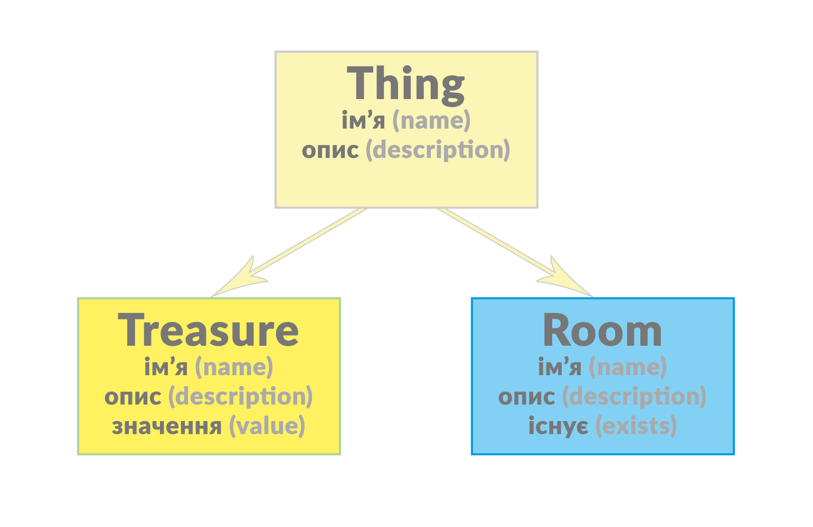

# Глава третя

> Ієрархія класів…

Ми закінчили попередній урок на тому, що створили два нових класи: `Thing` та `Treasure`. Якщо не брати до уваги те, що обидва класи мають схожий функціонал (обидва мають властивість `name`), між ними немає ніякого зв’язку. Наразі ці два класи досить прості, тому таке незначне повторення не грає великої ролі. Проте, коли ви почнете писати реальні програми більшої складності, ваші класи міститимуть численні змінні та методи, вам точно набридне перезаписувати одні й ті ж речі знову і знову.

Створити клас _спеціального типу_, щоб інший клас просто _наслідував_ його функціональність — цілком твереза ідея. У нашій простій пригодницькій грі, наприклад, `Treasure` є спеціальним типом, що належить до `Thing`, тому клас `Treasure` повинен наслідувати функціональність з класу `Thing`.

> **Ієрархія класів: предки та нащадки.** У цій книзі ми часто говоримо про _нащадків_ класів, які _наслідують_ функціональність від своїх класів–_предків_. Ці поняття навмисне наштовхують на своєрідні сімейні зв’язки між _спорідненими_ класами. В Ruby кожен клас має лише одного батька. Однак, класи  можуть бути спадкоємцями великих та багатих сімейних родів з багатьма поколіннями дідів, прадідів і так далі…

Поведінка `Things` загалом може бути описана у самому ж класі `Thing`. Клас `Treasure` автоматично _унаслідує_ всі можливості класу `Thing`, тому нам не потрібно перезаписувати все заново. Він же зможе згодом розшириити свої можливості, які стосуються лише `Treasures`.

У якості узагальненого правила, при створенні класової ієрархії, класи з найбільш узагальненою поведінкою є вище у ієрархії, ніж класи з більш специфічною поведінкою. Таким чином, клас `Thing`, який має лише ім’я (`name`) та опис (`description`), мав би бути предком класу `Treasure`, який має ім’я (`name`), опис (`description`), а ще, додатково, значення (`value`); клас `Thing` також може бути предком для іншого спеціалізованого класу, як от `Room`, який має ім’я (`name`), опис (`description`), а також може існувати (`exits`) — і так далі…



**Один батько — багато дітей…**

Діаграма, зображена вище, демонструє клас `Thing`, який має _ім’я_ та _опис_ (у програмі написаній на Ruby, це може бути представлено у вигляді внутрішніх змінних, як от `@name` та `@description`, а також деякими методами, для доступу до них). Обидва класи `Treasure` та `Room` є нащадками `Thing`, тож вони автоматично _унаслідують_ ім’я (`name`) та опис (`description`). Клас `Treasure` додає новий елемент: значення (`value`) – тож тепер він має **ім’я**, **опис** and **значення**; клас `Room` додає можливість існування (`exits`) – тож тепер має so it has **ім’я**, **опис** and **існує**.

[**`adventure1.rb`**](https://github.com/LambdaBooks/thelittlebookofruby/blob/master/examples/3/adventure1.rb):

Давайте розглянемо, як створити унаслідуваний клас у Ruby. Відкрийте програму **`adventure1.rb`**. Вона починається з простого визначення класу `Thing`, який має дві змінні екземплярів: `@name` та `@description`. Цим змінним, при створенні нового об’єкту `Thing`, присвоюється значення у методі `initialize`. До змінних екземплярів зазвичай не можна (і не слід) звернутись безпосередньо із зовнішнього світу поза цим класом, у відповідності до принципу інкапсуляції

> **«Інкапсуляція»** — це термін, який пов’язаний з _модульністю_ об’єкта. Простими словами, він означає, що лише сам об’єкт може займатись справами, які пов’язані з його внутрішнім станом. Все, що поза цим об’єктом — не може. Перевагою цього підходу є те, що програміст може змінювати імплементацію методів, не хвилюючись про те, що якийсь зовнішній код може покладатись на специфіку попередньої імплементації.

Для того, щоб отримувати значення кожної змінної у об’єкті `Thing`, нам потрібно створити _get_–аксесор, як от `get_name`; щоб присвоювати нові значення, нам знадобиться _set_–аксесор, як от`set_name`:

```ruby
def get_name
  return @name
end

def set_name(aName)
  @name = aName
end
```

## Батьківські (супер–) та дочірні (суб–) класи

Тепер подивіться на клас `Treasure`. Зверніть увагу на те, як він оголошений:

```ruby
class Treasure < Thing
```

Трикутна дужка, `<`, вказує на те, що `Treasure` є _субкласом_, або спадкоємцем, класу `Thing` і тому наслідує його дані (змінні) та поведінку (методи). Оскільки методи `get_name`, `set_name`, `get_description` та `set_description` вже існують в класі–предку (`Thing`), їх не потрібно переоголошувати у класі–нащадку (`Treasure`).

Клас `Treasure` має додаткову частинку даних — його значення (`@value`), тому я маю написати відповідні `get` та `set` аксесори для нього. Коли створюється новий об’єкт `Treasure`, автоматично викликається його метод `initialize`. Об’єкт `Treasure` має ініціалізувати три змінні (`@name`, `@description` та `@value`), тому метод `initialize` приймає три аргументи:

```ruby
def initialize(aName, aDescription, aValue)
```

Перші два аргументи передаються у метод `initialize` батьківського класу (`Thing`) з допомогою ключового слова `super`, тож метод `initialize` класу `Thing` може працювати з ними:

```ruby
super(aName, aDescription)
```

При використанні всередині методу, ключове слово `super` викликає метод з таким самим іменем у _батькіського (супер–)_ класу.

Поточний метод у класі `Treasure` викликає `initialize`, тому коли код всередині цього методу передає ці два аргументи (`aName`, `aDescription`) до `super`, це насправді передає їх до методу `initialize` батьківського класу `Thing`.

Якщо ключове слово `super` використовується саме по собі, без жодного вказаного аргументу, всі аргументи, які були передані до поточного методу, передаються до успадкованого метода.
