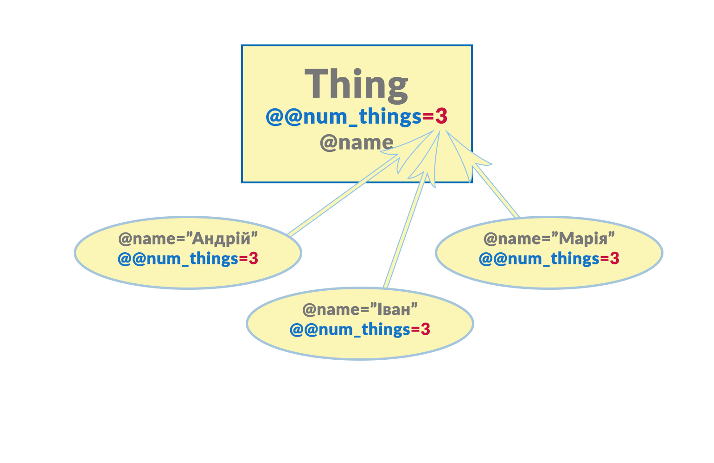

# Глава четверта

> Аксесори, атрибути та змінні класів…

Тепер, повертаючись до роботи над маленькою пригодницькою грою, яку я програмував раніше… Мені досі не подобається той факт, що в класах повно повторюваного коду для get та set аксесорів. Дайте мені подивитись, що я можу зробити, щоб виправити це.

## Методи–аксесори

Замість того, щоб звертатись до значення змінної екземпляру `@description` двома різними методами, `get_description` та `set_description`, ось так…

```ruby
puts(t1.get_description)
t1.set_description("Якийсь опис")
```

…було б набагато краще отримувати та присвоювати їх так само, як ми звикли отримувати та присвоювати значення з та в звичайні змінні, тобто ось так:

```ruby
puts(t1.description)
t1.description = "Якийсь опис"
```

Щоб зробити це можливим, мені потрібно змінити визначення класу `Treasure`.
Для цього потрібно переписати методи–аксесори для `@description` так, як показано нижче:

```ruby
def description
  return @description
end
```

```ruby
def description=(aDescription)
  @description = aDescription
end
```

[**`accessors.rb`**](https://github.com/LambdaBooks/thelittlebookofruby/blob/master/examples/4/ccessors.rb):

У програмі **`accessors.rb`** я додав аксесори подібно до того, як показано у прикладі вище. Є дві відмінності у порівнянні з моєю попередньою версією. По–перше, обидва аксесори називаються `description`, замість `get_description` та `set_description`; по–друге, після назви set–аксесора є знак рівності (`=`). Тепер можна присвоювати новий рядок ось так:

```ruby
t.description = "трохи зношена і побита по боках"
```

Або отримувати значення ось так:

```ruby
puts(t.description)
```

> **Зауважте:** Коли ви пишете set–аксесор таким чином, символ `=` має йти безпосередньо після ім’я методу, а не десь між ім’ям методу та його аргументами. Тому такий приклад є правильним:
>
> ```ruby
>  def name=(aName)
> ```
>
> А ось цей спричинить помилку:
>
> ```ruby
> def name =(aName)
> ```

## Читачі та записувачі атрибутів

Насправді є простіший та коротший спосіб отримати той же результат. Все, що вам потрібно зробити — це скористатись двома спеціальними методами: `attr_reader` та `attr_writer` — після яких повинен стояти символ:

```ruby
attr_reader :description
attr_writer :description
```

Вам потрібно додати цей код всередині оголошення ваших класів, проте поза будь–якими методами, ось так:

```ruby
class Thing
  attr_reader :description
  attr_writer :description

  # решта методів…
end
```

>**Символи**: У Ruby символом є ім’я, перед яким стоїть двокрапка. `Symbol` визначений у бібліотеці класів Ruby, щоб відображати імена всередині інтерпретатора Ruby. Вони можуть використовуватись по–різному. Наприклад, коли ви передаєте один або більше символів у якості аргументів `attr_reader` (це може бути не достатньо очевидним, але `attr_reader` є, насправді, методом класу `Module`),
Ruby створює екземпляр змінної та get–аксесор, щоб повертати значення цієї змінної; обидва екземпляри змінної та метод–аксесор матимуть таке ж ім’я, як і вказаний символ.

Виклик `attr_reader` з символом має такий же ефект, як і створення екземпляру змінної з ім’ям, що співпадає з символом та get–аксесором для цієї змінної.

Виклик `attr_writer` так само створює екземпляр змінної з set–аксесором. У цьому випадку змінна буде називатись `@description`. Змінні екземпляру вважаються “атрибутами” об’єкту — ось чому методи `attr_reader` та
`attr_writer` так називаються.

[**`accessors2.rb`**](https://github.com/LambdaBooks/thelittlebookofruby/blob/master/examples/4/accessors2.rb):

Програма **`accessors2.rb`** містить кілька робочих прикладів записувачів та читачів атрибутів у дії. Зауважте, що клас `Thing` визначає set–аксесор у скороченій формі (використовуючи `attr_writer` з символом) для змінної `@name`:

```ruby
attr_writer :name
```

Проте він має розгорнуту форму для get–аксесора – написаний повністю вручну метод – для тієї ж змінної:

```ruby
def name
  return @name.capitalize
end
```

Перевагою повного написання методу, як у прикладі вище, є те, що це відкриває для вас можливість додатково обробляти значення атрибуту, замість того, щоб просто читати або записувати його. Тут get–аксесор використовує метод `capitalize` класу `String`, щоб повернути значення `@name` з першою літерою у верхньому регістрі.

Атрибут `@description` не потребує додаткової обробки, тому я використовуватиму `attr_reader` та `attr_writer`, щоб встановлювати та отримувати значення змінної `@description`.

>**Атрибути чи властивості?** Не плутайтесь у термінології. У Ruby,
_“атрибут” (attributes)_ є еквівалентним до того, що у багатьох інших мовах програмування називається _“властивістю” (property)_.

Якщо ви хочете і читати, і записувати змінну, метод `attr_accessor` надає коротшу альтернативу замість окремих `attr_reader` та `attr_writer`. Я використав його для доступу до атрибуту `value` у класі `Treasure`:

```ruby
attr_accessor :value
```

Це еквівалентне до:

```ruby
attr_reader :value
attr_writer :value
```

## Атрибути створюють змінні

Раніше я сказав, що виклик `attr_reader` з символом насправді створює змінну з тим самим ім’ям, що і у символі.

Метод `attr_accessor` також робить це. У коді до класу `Thing`, така поведінка не зовсім очевидна оскільки клас має метод `initialize` явно створює змінні.

Однак, клас `Treasure` не посилається до змінної `@value` у своєму методі `initialize`:

```ruby
class Treasure < Thing
  attr_accessor :value

  def initialize(aName, aDescription)
    super(aName, aDescription)
  end
end
```

Єдиною вказівкою на те, що змінна `@value` існує — є визначення аксесора, яке оголошує атрибут `value`:

```ruby
attr_accessor :value
```

Мій код у кінці вихідного файлу встановлює значення кожному об’єкті `Treasure`:

```ruby
t1.value = 800
```

Навіть якщо вона ніде формально не оголошена, змінна `@value` справді існує і ми можемо отримати її числове значення з допомогою get–аксесора:

```ruby
t1.value
```

Щоб бути точно впевненим у тому, що аксесор атрибуту справді створив `@value`, ви завжди можете подивитись всередину об’єкту з допомогою методу `inspect`. Я так і зробив, тому у останніми двома рядками коду у цій програмі є:

```ruby
puts "Це treasure1: #{t1.inspect}"
puts "Це treasure2: #{t2.inspect}"
```

Аксесори атрибутів можуть ініціалізувати більше, ніж один атрибут за раз, якщо ви передасте їм список символів у вигляді аргументів розділених функціями, ось так:

```ruby
attr_reader :name, :description
attr_writer(:name, :description)
attr_accessor(:value, :id, :owner)
```

Як завжди, у Ruby дужки довкола аргументів є необов’язковими.

[**`adventure2.rb`**](https://github.com/LambdaBooks/thelittlebookofruby/blob/master/examples/4/adventure2.rb):

Тепер, давайте подивимось, як використати читачі та записувачі атрибутів у моїй пригодницькій грі. Завантажте програму **`adventure2.rb`**. Ви побачите, що я створив два атрибути класу `Thing`, які доступні на читання: `name` та `description`. Я також зробив `description` доступним на запис; однак, оскільки я не планую змінювати ім’я жодного об’єкту `Thing`, атрибут `name` є недоступним на запис:

```ruby
attr_reader(:name, :description)
attr_writer(:description)
```

Я створив метод `to_s`, який повертає рядок, що описує об’єкт `Treasure`. Нагадаю, що всі класи в Ruby мають стандартний метод `to_s`. Метод `to_s` класу `Thing` перезаписує (а також замінює) метод за замовчуванням. Ви можете перезаписати методи, якщо ви хочете імплементувати нову поведінку для певного типу класів.

## Виклик методів батьківського класу

Я вирішив, що моя гра матиме два класи, що наслідуються від `Thing`. Клас `Treasure` додає атрибут `value`, який можна і читати, і записувати. Зауважте, що його метод `initialize` викликає батьківський клас для того, щоб ініціалізувати атрибути `name` та `description` перед ініціалізацією змінної `@value`:

```ruby
super(aName, aDescription)
@value = aValue
```

Тут, якщо б я упустив виклик батьківського класу, атрибути `name` та `description` не ініціалізувалися б. Так сталося б тому, що `Treasure.initialize` перезаписує `Thing.initialize`, тому що коли об’єкт `Treasure` створюється, код у `Thing.initialize` не виконається автоматично.

> У деяких книгах про Ruby, між іменами класу та методу може стояти символ решітки: `Treasure#initialize`. Це лише правило з документації (яке я ігнорую) і не є частиною синтаксису Ruby. !!! I guess it’s just a case of ‚You say tomayto and I
say tomahto; !! ви кажете `Treasure#initialize`, а я кажу `Treasure.initialize`.
Ось так, давайте не сперечатись через це — це всього лише пунктуація…!

З іншого боку, клас `Room` також наслідується від `Thing` і поки не має методу `initialize`, тому коли створюється новий об’єкт `Room`, Ruby проходить по класовій ієрархії у пошуках класу, який має такий метод. Першим методом `initialize`, який він знайде, буде метод, що належить `Thing` — так ініціалізуються `name` та `description` атрибути об’єкта `Room`.

## Змінні класів

Є також декілька інших цікавих речей у цій програмі. Відразу на початку класу `Thing` ви можете побачити:

```ruby
@@num_things = 0
```

Два символи `@` на початку імені цієї змінної оголошують, що змінна `@@num_things` є _змінною класу (class variable)_. Змінні, які ми використовували всередині класів, дотепер були змінними екземплярів, і починались з одного `@`, як от `@name`. Для них кожен новий об’єкт (або _екземпляр_) цього класу присвоював свої власні значення для своїх власних змінних екземпляру. На відміну від змінних екземплярів, всі об’єкти, що походять від певного класу, поділяють між собою одні й ті ж змінні класів.Я присвоїв `0` змінній `@@num_things`, щоб бути певним, що вона має правильне значення з самого початку.

Тут, змінна `@@num_things` має зберігати загальне число об’єктів `Thing` у грі. Ми робимо це простим інкрементуванням змінної класу (ми використовуємо `+=`, щоб додати до змінної `1`) у методі `initialize` щоразу, коли створюється новий об’єкт, ми виконуємо:

```ruby
@@num_things +=1
```

Якщо ви подивитесь на мій код, ви побачите, що я створив клас `Map`, щоб зберігати масив кімнат (rooms). Він включає версію методу `to_s`, який виводить інформацію для кожної кімнати у масиві. Не турбуйтесь про імплементацію класу `Map`: ми розглянемо масиви та їхні методи дуже скоро.



Ця діаграма показує клас `Thing` (прямокутний), який містить змінну класу `@@num_things` та змінну екземпляру `@name`. Три овали зображують `Thing`–об’єкти – тобто _екземпляри_ класу `Thing`.  Коли один з цих об’єктів присвоює значення своїй змінній екземпляра `@name`, це значення впливає лише на змінну `@name` цього об’єкта – ось чому кожен об’єкт має різне значення `@name`. Проте, коли об’єкт присвоює значення змінній класу `@@num_things` це значення “живе всередині” самого класу _Thing_ і _розділяється_ між усіма екземплярами цього класу. На малюнку `@@num_things` рівне `3` і це справджується для всіх об’єктів `Thing`.

Знайдіть код наприкінці файлу та запустіть програму, щоб побачити, як ми створили та ініціалізувати всі три об’єкти та використали змінну класу `@@num_things`, щоб загальну кількість об’єктів `Thing`, які ми створили.
